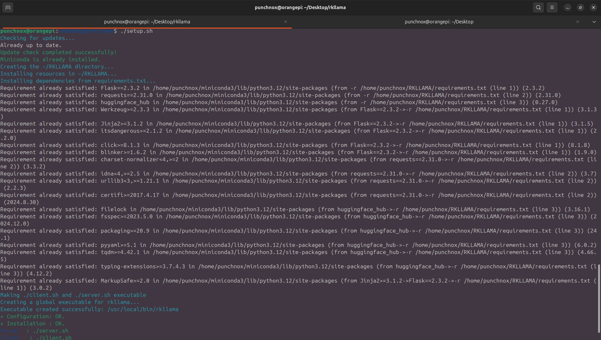
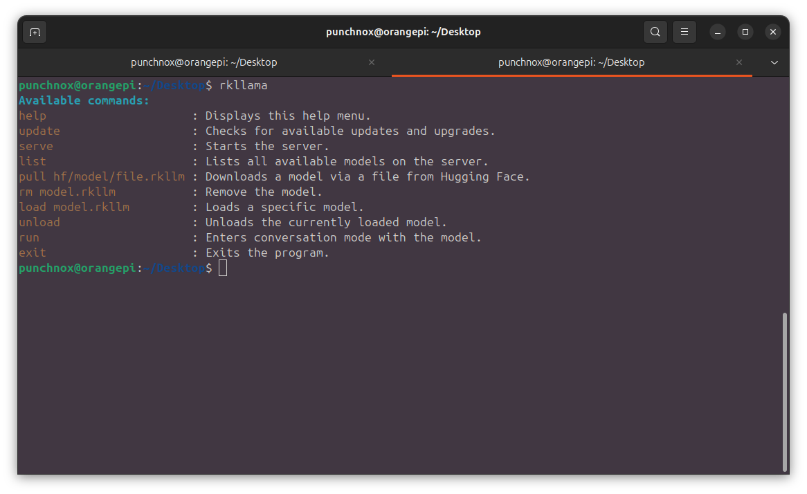
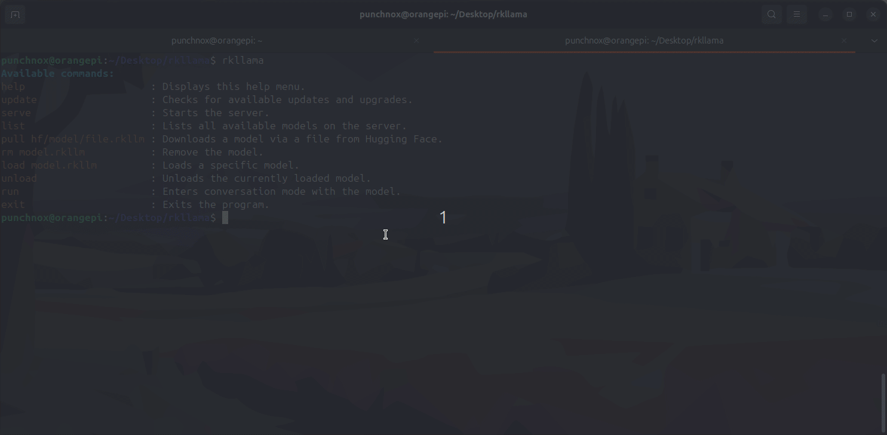
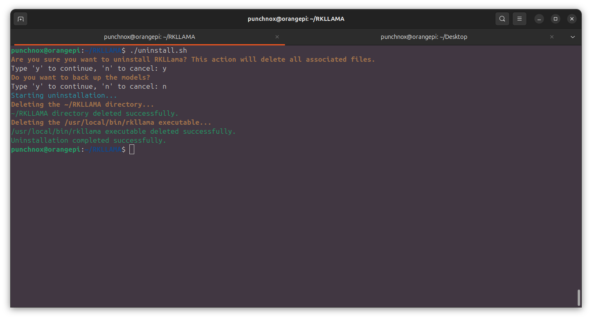

# RKLLama : Serveur et Client LLM pour Rockchip 3588/3576

### Version : 0.0.1

---

Démo vidéo : [youtube](https://www.youtube.com/watch?v=Kj8U1OGqGPc)

English version : [cliquer ici](../README.md)


## Aperçu
Un serveur permettant d'exécuter et d'interagir avec des modèles LLM optimisés pour les plateformes Rockchip RK3588(S) et RK3576. La différence avec d'autres logiciels similaires tels que [Ollama](https://ollama.com) ou [Llama.cpp](https://github.com/ggerganov/llama.cpp) est que RKLLama permet l'exécution des modèles sur le NPU.

* Version `Lib rkllm-runtime` : V1.1.4.
* Testé sur un `Orange Pi 5 Pro (16 Go de RAM)`.

## Structure des fichiers
- **`./models`** : contient vos modèles rkllm.  
- **`./lib`** : bibliothèque C++ `rkllm` utilisée pour l'inférence et `fix_freqence_platform`.  
- **`./app.py`** : serveur API Rest.  
- **`./client.py`** : client pour interagir avec le serveur.  

## Versions de Python supportées :
- Python 3.8 à 3.12

## Matériel et environnement testés
- **Matériel** : Orange Pi 5 Pro : (Rockchip RK3588S, NPU 6 TOPS).  
- **OS** : [Ubuntu 24.04 arm64.](https://joshua-riek.github.io/ubuntu-rockchip-download/)

## Principales fonctionnalités
- **Exécution des modèles sur le NPU.**
- **Compatibilité partielle avec l'API Ollama** - Support principal pour les endpoints `/api/chat` et `/api/generate`.
- **Appel d'Outils/Fonctions** - Support complet des appels d'outils avec plusieurs formats LLM (Qwen, Llama 3.2+, autres).
- **Téléchargement direct des modèles depuis Huggingface.**  
- **Inclut une API REST avec documentation.**  
- **Liste des modèles disponibles.**  
- **Chargement et déchargement dynamique des modèles.**  
- **Requêtes d'inférence.**  
- **Modes streaming et non-streaming.**  
- **Historique des messages.**

## Documentation

- Client : [Guide d'installation](#installation).  
- API REST : [Documentation en anglais](./api/english.md)  
- API REST : [Documentation en français](./api/french.md)
- API Ollama : [Guide de compatibilité](./api/ollama-compatibility.md)
- Appel d'Outils : [Guide d'appel d'outils/fonctions](./api/tools.md)  

## Installation
1. Téléchargez RKLLama :
```bash
git clone https://github.com/notpunchnox/rkllama
cd rkllama
```

2. Installez RKLLama :
```bash
chmod +x setup.sh
sudo ./setup.sh
```
**Résultat :**


## Utilisation

### Démarrer le serveur
*La virtualisation avec `conda` démarre automatiquement, ainsi que le réglage de la fréquence du NPU.*  
1. Lancez le serveur :
```bash
rkllama serve
```
**Résultat :**


### Démarrer le client
1. Commande pour lancer le client :
```bash
rkllama
```
ou 
```bash
rkllama help
```
**Résultat :**


2. Voir les modèles disponibles :
```bash
rkllama list
```
**Résultat :**


3. Exécuter un modèle :
```bash
rkllama run <nom_du_modèle>
```
**Résultat :**


Ensuite, commencez à discuter *( **mode verbeux** : affiche l'historique formaté et les statistiques )*  


## Ajouter un modèle (`fichier.rkllm`)

### **Utiliser la commande `rkllama pull`**
Vous pouvez télécharger et installer un modèle depuis la plateforme Hugging Face avec la commande suivante :

```bash
rkllama pull nom_utilisateur/id_repo/fichier_modele.rkllm
```

Sinon, vous pouvez exécuter la commande de manière interactive :

```bash
rkllama pull
ID du dépôt (exemple : punchnox/Tinnyllama-1.1B-rk3588-rkllm-1.1.4) : <votre réponse>
Fichier (exemple : TinyLlama-1.1B-Chat-v1.0-rk3588-w8a8-opt-0-hybrid-ratio-0.5.rkllm) : <votre réponse>
```

Cela téléchargera automatiquement le fichier modèle spécifié et le préparera pour une utilisation avec RKLLAMA.

*Exemple avec Qwen2.5 3b de [c01zaut](https://huggingface.co/c01zaut) : https://huggingface.co/c01zaut/Qwen2.5-3B-Instruct-RK3588-1.1.4*  


---

### **Installation manuelle**
1. **Téléchargez le modèle**  
   - Téléchargez les modèles `.rkllm` directement depuis [Hugging Face](https://huggingface.co).  
   - Alternativement, convertissez vos modèles GGUF au format `.rkllm` (outil de conversion à venir sur [mon GitHub](https://github.com/notpunchnox)).  

2. **Placez le modèle**  
   - Accédez au répertoire `~/RKLLAMA/models` sur votre système.  
   - Placez les fichiers `.rkllm` dans ce répertoire.  

   Exemple de structure de répertoire :  
   ```
   ~/RKLLAMA/models/
       └── TinyLlama-1.1B-Chat-v1.0.rkllm
   ```

## Désinstallation

1. Allez dans le dossier `~/RKLLAMA/` :
    ```bash
    cd ~/RKLLAMA/
    cp ./uninstall.sh ../
    cd ../ && chmod +x ./uninstall.sh && ./uninstall.sh
    ```

2. Si vous n'avez pas le fichier `uninstall.sh` :
    ```bash
    wget https://raw.githubusercontent.com/NotPunchnox/rkllama/refs/heads/main/uninstall.sh
    chmod +x ./uninstall.sh
    ./uninstall.sh
    ```

**Résultat :**


---

## Fonctionnalités à venir
- Possibilité de télécharger des modèles  
- Ajout de modèles multimodaux  
- Ajout de modèles d'embedding  
- Logiciel de conversion `GGUF vers RKLLM`  

---

Moniteur système :


---

## Auteur :
[notpunchnox](https://github.com/notpunchnox/rkllama)
